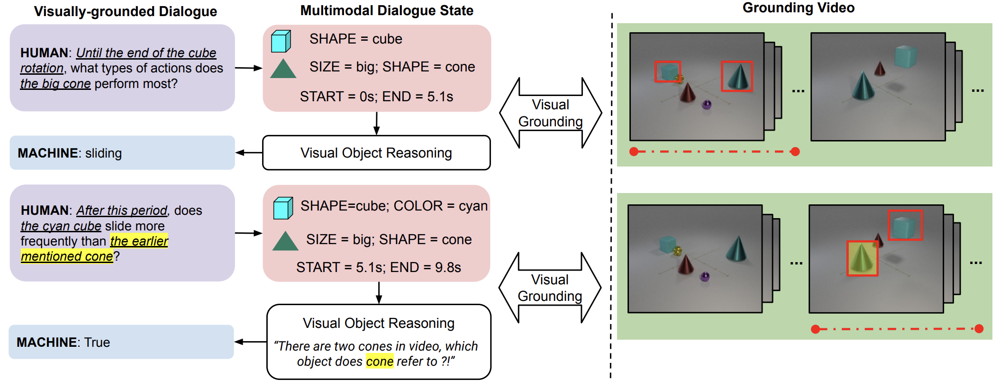
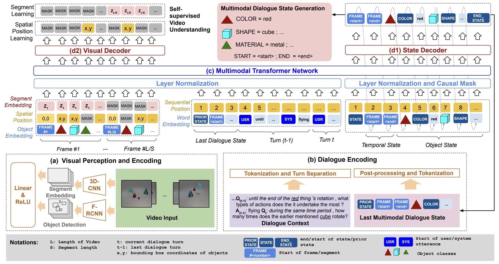

## Multimodal Dialogue State Tracking 

This is the official code for the paper **[Multimodal Dialogue State Tracking](https://arxiv.org/abs/2206.07898)** (NAACL 2022, Oral).  

Authors:
[Hung Le](https://sites.google.com/view/henryle2018/home), [Nancy F. Chen](https://scholar.google.com.sg/citations?user=K3Z9UiAAAAAJ&hl=en), [Steven C.H. Hoi](https://scholar.google.com/citations?user=JoLjflYAAAAJ&hl=en) 

### Contents:
* [x] [Paper Overview](##mmdst)
* [x] [Installation](##install)
* [] [Datasets](##dataset)
	* [] [DVD-DST](###dvd-dst)
	* [] [Bounding Box Feature Extraction](###boundingbox)
	* [] [ResNeXt Feature Extraction](###resnext)
* [ ] [Model](##model)
* [x] [Processes](##processes)  
	* [x] [Preprocessing Data](###preprocess)
	* [x] [Training](###training)
	* [x] [Generating Dialogue States](###evaluate)
	* [x] [Evaluating Dialogue States](###evaluation)
* [x] [Citation](##cite)
* [x] [License](#license) 

## Overview  

 

  
<b>Multimodal Dialogue State Tracking (MM-DST)</b>: We proposed to extend the traditional DST from
unimodality to multimodality. Compared to traditional DST, MM-DST define dialogue states, consisting of
slots and slots values for visual objects that are mentioned in dialogues

  
<b>Video-Dialogue Transformer Network(VDTN)</b>: For the MM-DST task, we propose a strong baseline, VDTN. The model has 4 key components: (a) Visual Perception and Encoder (b) Dialogue Encoder (c) Transformer Network (d1) State Decoder and (d2) Visual Decoder.

## Installation  

The code was created with Pytorch 1.9.0. Please follow [this](https://pytorch.org/) to install the appropriate Pytorch libraries. 

## Dataset 

**Note**: We will release the URL to download the DVD-DST benchmark, including dataset of dialogues and videos with extracted bounding box and ResNeXt features.

### DVD-DST 

We propose a new dataset, DVD-DST, which was developed based on [DVD](https://github.com/facebookresearch/DVDialogues), our prior work in response prediction for synthetic video-grounded dialogue benchmark. 
Compared to DVD, DVD-DST includes annotations for dialogue state tracking and ground-truth bounding box labels from [an extended split](https://github.com/ofrikleinfeld/ObjectPermanence) of the CATER video dataset. 

### Bounding Box Feature Extraction 
To extract bounding of visual objects, we adopt the learned Faster R-CNN model used published [here](https://github.com/ofrikleinfeld/ObjectPermanence). The model was finetuned
to predict object bounding boxes and object classes.
The object classes are derived based on object appearance, based on the four attributes of size, color,
material, and shape. In total, there are 193 object
classes. 

### ResNeXt Feature Extraction 
For segment embeddings, we adopted the ResNeXt-101 model pretrained [here](https://github.com/kenshohara/video-classification-3d-cnn-pytorch) which was finetuned on the Kinetics dataset.

Download all files and unzip to the `data` folder. This should include 2 folders, `dvd` for dialogue data and `cater` for the video data. 

## Model 

We will release our pretrained VDTN model checkpoint which was finetuned on the DVD-DST benchmark.
When evaluated on the test split of the DVD-DST benchmark, this model should achieve the following results:

| Obj Identity F1 | Obj Slot F1 | Obj State F1 | Joint Acc | Acc IoU@0.5 | Acc IoU@0.7 |
|:---------------:|:-----------:|:------------:|:---------:|:-----------:|:-----------:|
|       84.5      |     72.8    |     60.4     |    28.0   |     15.3    |     13.1    |

## Processes 

### Preprocessing Data 

We create `scripts/run_preprocess.sh` to preprocess data on the DVD-DST benchmark. The preprocessing steps include procedures to extract dialogue state annotations from DVD-style annotations. These steps also include connecting the object ID (classes) from bounding box features to create dialogue state labels. 

You can directly run this file by configuring the following parameters: 

| Parameters  | Description                                  | Example Values                      |
|-------------|----------------------------------------------|-------------------------------------|
| `results_dir` | Path to save preprocessed data               | data/preprocessed                  |
| `config`      | Path to the preprocessing configuration file | configs/preprocess_dial\_config.json |

To preprocess different data split, please modify the fields `dials_dir` and `video_dir` in the configuration file e.g. `configs/preprocess_dial_config.json`. For instance, the current configuration file is to preprocess the validation split in the DVD-DST benchmark. 

### Training Models 

We created `scripts/run_train.sh` to train a VDTN model on the DVD-DST benchmark.
You can directly run this file by configuring the following parameters: 

| Parameters  | Description                                  | Example Values                      |
|-------------|----------------------------------------------|-------------------------------------|
| `model_config` | Path to the model configuration file               | configs/vdtn_model\_config.json                  |
| `training_config`      | Path to the training configuration file | configs/training\_vdtn\_config.json |

For more fine-grained parameters, please refer to the corresponding configuration files. Some important parameters are defined below: 

| Parameters   | Description                                                                                                                                 | Example Values                                                                   |
|--------------|---------------------------------------------------------------------------------------------------------------------------------------------|----------------------------------------------------------------------------------|
| `prior_state`  | Whether to use the dialogue states of previous turns as parts of input sequence                                                             | 1: use prior state; 0: do not use                                                |
| `max_turns`    | Maxinum number of past dialogue turns to use; usually set to small values (e.g. 1) if prior_state is set to 1                               | 0 to 10 (0 if do not use dialogue history; max 10 turns in the DVD universe)     |
| `frame_rate`   | Sampling rate of video features. One feature vector will be selected per frame_rate frames. Same for segment-based (e.g. ResNeXt features). | 1 to 300 (1 to sample all possible frames, max 300 frames in the CATER universe) |
| `max_objects`  | Maximum number of object-based features (bounding boxes) per frame                                                                          | 1, 2, 3, ...                                                                     |
| `mask_bb`      | Whether to randomly mask bounding box features for self-supervised learning tasks                                                           | 1: mask; 0: do not mask                                                          |
| `mask_resnext` | Wether to randomly mask resnext features for self-supervised learning tasks                                                                 | 1: mask; 0: do not mask                                                          |

Running the training script will initialize a VDTN model, load the preprocessed data and pre-extracted features, and start the training process. Model checkpoints are saved whenever the validation loss improves. All checkpoints and loss logs (`log.csv`) are saved to a folder (e.g. `exps/mmdst_dvd_vdtn/`) specified by the `checkpoints_path` parameter of the training configurations. 

### Generating Dialogue States 

We created `scripts/run_test.sh` to generate dialogue states using a learned VDTN model on the DVD-DST benchmark.
You can directly run this file by configuring the following parameters: 

| Parameters  | Description                                  | Example Values                      |
|-------------|----------------------------------------------|-------------------------------------|
| `model_path` | Path to the saved model checkpoint file               | exps/mmdst\_dvd\_vdtn/ model\_checkpoint.pth                 |
| `inference_config`      | Path to the generation/inference configuration file | configs/inference\_vdtn\_config.json |
| `inference_style`      | Decoding style to generate tokens of dialogue state sequences | greedy: greedy decoding; beam_search: beam search decoding |

For more fine-grained parameters e.g. `state_maxlen` (maximum number of tokens in the output sequences), please refer to the corresponding configuration file.

### Evaluating Dialogue States 

To evaluate generated dialogue states, we adopt automatic metrics from conventional unimodal DST and include additional metrics such as Object Identity F1, Slot F1, IoU@k (for time-based slots), etc. 

We created `compute_acc.py` to calcuate these metrics. To run this file, specific the following parameters: 

| Parameters | Description                                                 | Example Values                                               |
|------------|-------------------------------------------------------------|--------------------------------------------------------------|
| `results`    | Path to the generated dialogue states                       | e.g. exps/mmdst\_dvd\_vdtn/ all\_preds.json |
| `frame_rate` | The corresponding frame_rate used during training/test time | e.g. 12                                                      |
| `by_turns`   | Whether to generate automatic metrics by turn positions     | include `--by_turns` in command to output turn-specific results         |

## Citation 

If you find the paper or the source code useful to your projects, please cite the following bibtex: 
<pre>
@article{le2022multimodal,
  title={Multimodal Dialogue State Tracking},
  author={Le, Hung and Chen, Nancy F and Hoi, Steven CH},
  journal={arXiv preprint arXiv:2206.07898},
  year={2022}
}
</pre>

## License 

The code is released MIT License - see `LICENSE.txt` for details.

This code is developed from other open source projects: including our prior work DVD, CATER, and CATER for object tracking. 
We thank the original contributors of these works for open-sourcing their valuable source codes. 

